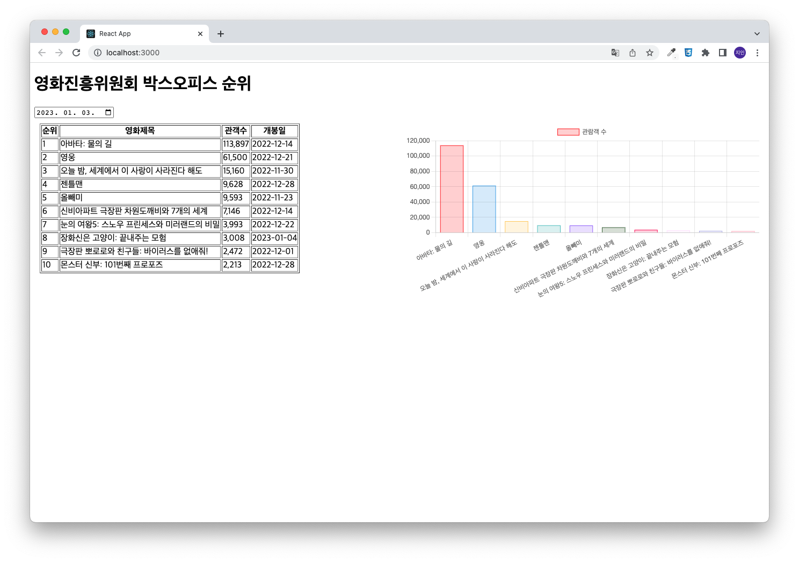

# 유지인 통합구현 평가문제

## 영화진흥위원회 OpenAPI 인증키 발급화면


## App.js
```javascript
import React, { memo, useState, useEffect, useCallback, useMemo } from "react";
import styled from "styled-components";

import { useSelector, useDispatch } from 'react-redux'
import { getMovieRank } from "./slices/MovieRankSlice";

// 로딩바 컴포넌트
import Spinner from './components/Spinner';
// 에러정보를 표시하기 위한 컴포넌트
import ErrorView from './components/ErrorView';
// 그래프 표시르 위한 컴포넌트
import BarChartView from './components/BarChartView';
// 미디어쿼리
import mq from './MediaQuery';
// 날짜 처리 라이브러리
import dayjs from "dayjs";

const Container = styled.div`
    ${mq.minWidth('md')`
        display: flex;
        flex-direction : row;
        flex-wrap: nowrap;

        .flex-item {
            width: 50%;
            box-sizing: border-box;
            padding: 10px;
        }
    `}
`;

const App = memo(() => {
  const { data, loading, error} = useSelector((state) => state.MovieRankSlice);

  const dispatch = useDispatch();

  const [targetDt, setTargetDt] = useState(dayjs().add(-1, 'd').format('YYYY-MM-DD'));

  useEffect(() => {
    dispatch(getMovieRank({
      targetDt: targetDt.replaceAll('-', '')
    }));
  },[targetDt]);

  // 드롭다운 이벤트
  const onDataChange = useCallback((e) => {
    e.preventDefault();
    setTargetDt(e.target.value);
  },[]);

  // data가 변경되었을 때, 사이드 이펙트를 처리하여 그래프에 적용할 데이터를 생성한다.
  const { movieNm, audiCnt } = useMemo(() => {
    const newData = { movieNm: [], audiCnt: []};

    if (data) {
      data.boxOfficeResult.dailyBoxOfficeList.forEach((v, i) => {
        newData.movieNm.push(v.movieNm);
        newData.audiCnt.push(v.audiCnt);
      });

      console.log(newData);
    }

    return newData;
  },[data]);

  return (
    <div>
      <Spinner loading={loading} />

      <h1>영화진흥위원회 박스오피스 순위</h1>

      <form>
        <input type="date" className="form-control" placeholder="연도-월-일"  onChange={onDataChange}/>
      </form>

      {error? <ErrorView error={error} /> : (
            <Container>
                
                <div className="flex-item">
                    <table border='1'>
                        <thead>
                            <tr>
                                <th>순위</th>
                                <th>영화제목</th>
                                <th>관객수</th>
                                <th>개봉일</th>
                            </tr>
                        </thead>
                        <tbody>
                            {data && data.boxOfficeResult.dailyBoxOfficeList.map((v, i) => {
                                return (
                                    <tr key={i}>
                                        <td>{v.rank}</td>
                                        <td>{v.movieNm}</td>
                                        <td>{Number(v.audiCnt).toLocaleString()}</td>
                                        <td>{v.openDt}</td>
                                    </tr>
                                )
                            })}
                        </tbody>
                    </table>
                </div>
                <div className="flex-item">
                    <BarChartView labels={movieNm} dataset={audiCnt} legend='관람객 수' />
                </div>
            </Container>
        )}
    </div>
  );
});

export default App;

```

## store.js
```javascript
import { configureStore } from "@reduxjs/toolkit";
import MovieRankSlice from "./slices/MovieRankSlice";

const store = configureStore({
    reducer: {
        MovieRankSlice: MovieRankSlice,
    }
});

export default store;
```

## slices/MovieRankSlice.js
```javascript
import { createSlice, createAsyncThunk } from '@reduxjs/toolkit'
import axios from 'axios';

export const getMovieRank = createAsyncThunk('MovieRankSlice/getMovieRank', async (payload, { rejectWithValue }) => {
    let result = null;

    try {
        const response = await axios.get(process.env.REACT_APP_KOBIS_API_URL, {
            params: {
                key: process.env.REACT_APP_KOBIS_API_KEY,
                targetDt: payload.targetDt
            }
        });
        result = response.data;

        if(result.faultInfo !== undefined) {
            const err = new Error();
            err.response = {status: 500, statusText: result.faultInfo.message};
            throw err;
        } 
    } catch (err) {
        result = rejectWithValue(err.response);
    }

    return result;
});

const MovieRankSlice = createSlice({
    name: 'MovieRankSlice',
    initialState: {
        data: null,
        loading: false,
        error: null
    },
    reducers: {},
    extraReducers: {
        [getMovieRank.pending]: (state, { payload }) => {
            return {...state, loading: true }
        },
        [getMovieRank.fulfilled]: (state, { payload }) => {
            return {
                data: payload, 
                loading: false,
                error: null
            }
        },
        [getMovieRank.rejected]: (state, { payload }) => {
            return {
                ...state, 
                loading: false,
                error: {
                    code: payload.status ? payload.status : 500,
                    message: payload.statusText ? payload.statusText : 'Server Error'
                }
            }
        }
    },
});

export default MovieRankSlice.reducer;
```

## components/BarChartView.js
```javascript
import React, { memo } from 'react';

import {
    Chart as ChartJS,
    CategoryScale,
    LinearScale,
    BarElement,
    Title,
    Tooltip,
    Legend
} from 'chart.js';

import { Bar } from 'react-chartjs-2';

ChartJS.register(
    CategoryScale,
    LinearScale,
    BarElement,
    Title,
    Tooltip,
    Legend
)

const BarChartView = memo(({ labels, dataset, legend}) => {
    /** 그래프 옵션 */
    const options = {
        indexAxis: 'x',
        responsive: true
    };

    /** chart에 표시될 데이터 (막대그래프용) */
    const data = {
        labels: labels,
        datasets: [{
            label: legend,
            backgroundColor:['rgba(255, 0, 0,0.2)', 'rgba(54, 162, 235, 0.2)', 'rgba(255, 206, 86, 0.2)', 'rgba(75, 192, 192, 0.2)', 'rgba(153, 102, 255, 0.2)', 'rgba(53, 100, 50, 0.2)', 'rgba(250, 10, 100, 0.2)', 'rgba(254, 224, 255, 0.2)', 'rgba(183, 183, 234, 0.2)', 'rgba(255, 178, 195, 0.2)'],
            borderColor: ['rgba(255, 0, 0,1)', 'rgba(54, 162, 235, 1)', 'rgba(255, 206, 86, 1)', 'rgba(75, 192, 192, 1)', 'rgba(153, 102, 255, 1)', 'rgba(53, 100, 50, 1)', 'rgba(250, 10, 100, 1)', 'rgba(254, 224, 255, 1)', 'rgba(183, 183, 234, 1)', 'rgba(255, 178, 195, 1)'],
            borderWidth: 1,
            data: dataset,
        }]
    };

    return ((labels && dataset) && <Bar data={data} options={options} />);  
});

BarChartView.defaultProps = {
    labels: [],
    dataset: [],
    legend: ''
}

export default BarChartView;
```

실행결과의 스크린샷


